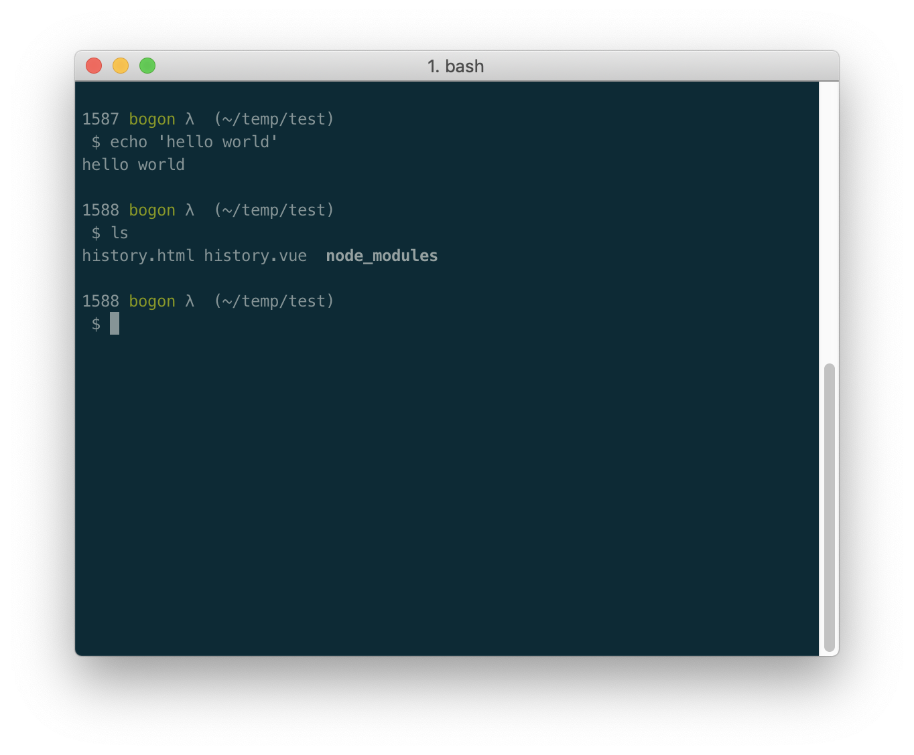
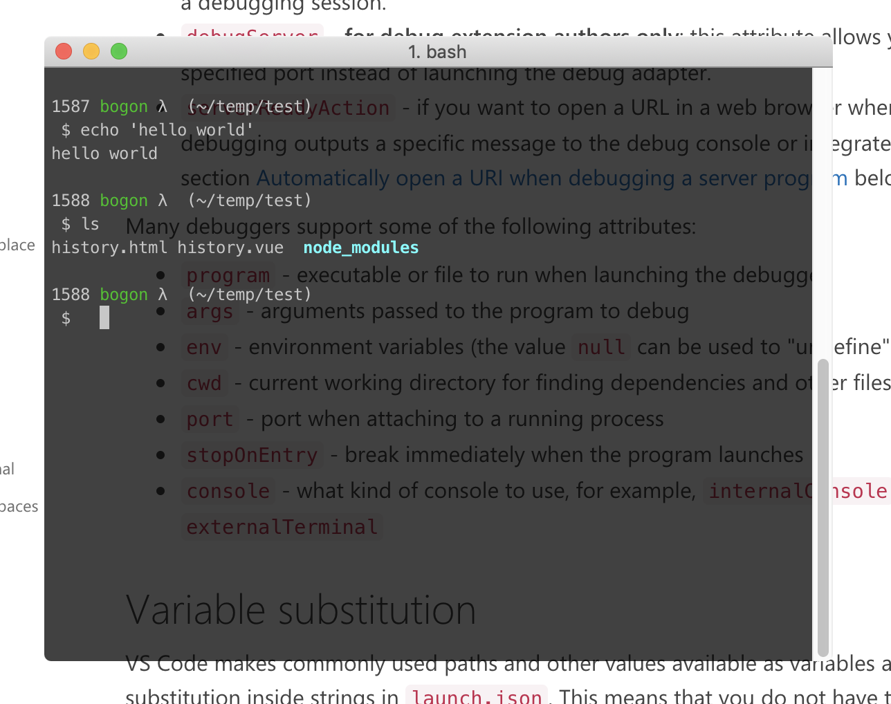
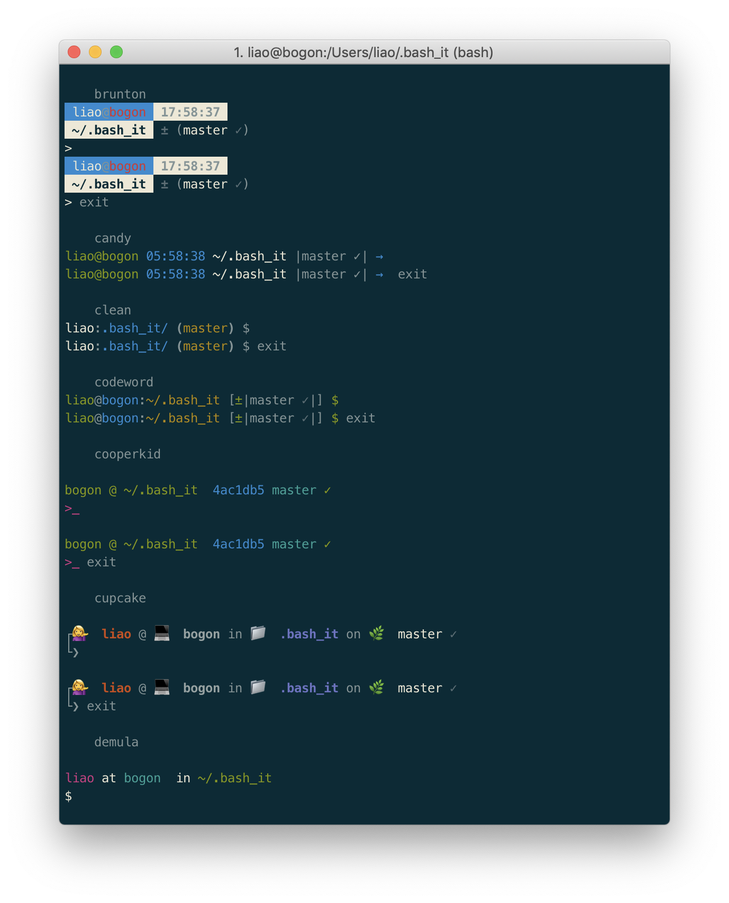
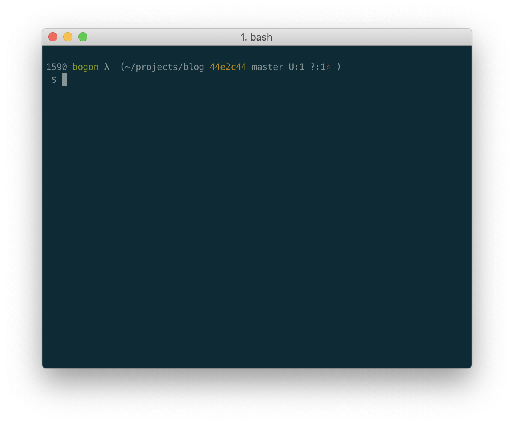
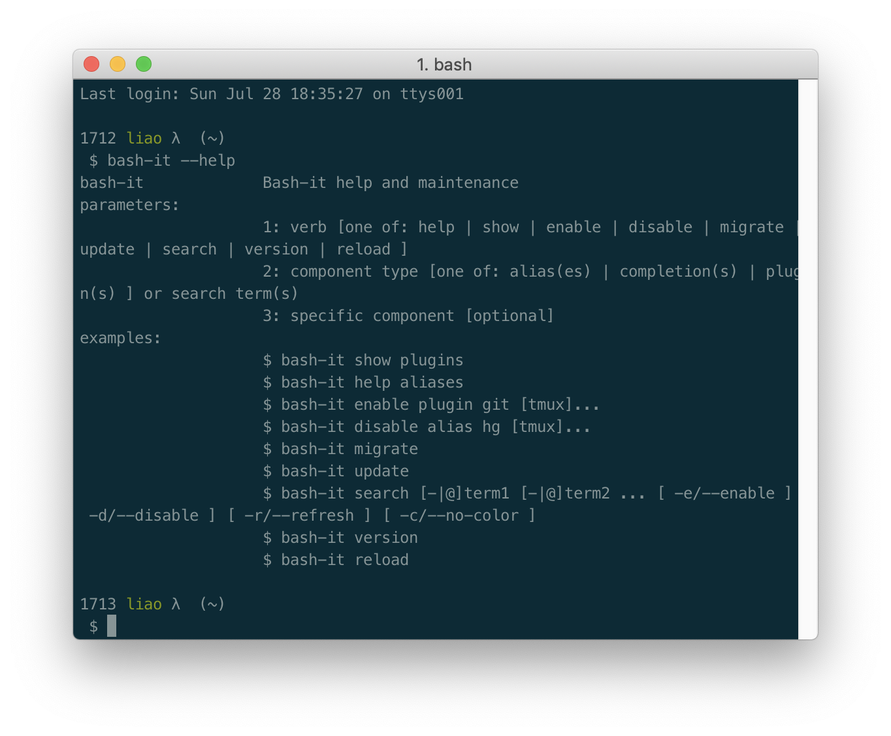

# [工具篇] iTerm2——打造漂亮的Mac终端

> 你可以不会几个命令，但你必须要有一个好看的命令行工具。

本文没啥技术含量，就是介绍如何安装一个漂亮又好用的命令行工具。网上已经有很多介绍 iTerm2 的文章了，我这篇是记录一下自己的配置。软件只适用于 Mac 电脑，用 Windows 的同学 可以去用 `cmder`。

## iTerm2 


iTerm2   是Mac 上用来取代 Terminal 的一款终端模拟器，可以说是 Mac 上最强大<sup>(almost)</sup> 的终端模拟器（当然除了它和Terminal 我也没用过其他的）。详细可以看看[官网](https://www.iterm2.com/index) 上的介绍，或者直接看下文。

其实现在已经是 version 3 了，不过还是叫 iTerm2 ，别问为啥，我也不知道。

### 安装

1. Homebrew 安装（推荐）

   ```bash
   brew cask install iterm2
   ```

2. 官网下载安装

   [下载链接](https://iterm2.com/downloads/stable/latest) 

### 与 Terminal 的区别

总之就是比 Terminal 多了很多方便好用的功能，虽然很多强大的功能我没用过，常用的有：

- 历史记录。快捷键是 **cmd+shift+h** 
- 自动补全。快捷键 **cmd+;**
- 分割多面板
- 全局搜索。**cmd+f**

- …...

### 设置为默认命令行终端

打开 iTerm2，点击左上角按钮 `iTerm2 -> Make iTerm2 Default Term` 即可。

## 配色

#### Solarized Dark

网友们大多推荐的配色是**Solarized** ，确实挺好看的。先[下载](http://ethanschoonover.com/solarized/files/solarized.zip) 配置包，解压后里面有适用于各种软件的主题文件，我们需要的是 iTerm2 的文件。

安装方式：

`Proference`->`Profile`->`Colors`->`Color Presets`->`Import`

选择`iterm2-color-solarized`文件夹下的`Solarized Dark`和`Solarized Light`即可。

*Solarized Dark*：



#### 透明背景色

不过我还是习惯用透明的背景色，没有双屏的情况下，把参考文档放在底下对着敲还是比较爽的。

`Proference`->`Profile`->`Colors`->`Color Presets`选择自带的`Dark Background`，然后在`Window`->`Transparency`设置一个透明度。

像这样：



## Bash vs Zsh

很多教程介绍了 iTerm2 和 **oh-my-zsh** 搭配使用，**Zsh** 确实好用，但我用了一段时间又回归到 **Bash** 了，主要原因是大多系统默认只有 Bash，Zsh 用多了再去用 Bash 会不太适应…...

Bash 是 Unix-like 系统自带的命令行，Zsh（读作：Z shell）是开源社区主导的命令行，所以有很多人开发各种插件和主题。**oh-my-zsh** 就是聚集了各种 Zsh 插件和主题的平台，很多好看的主题都来自于此。

Zsh 功能更强大，比如命令输入提示功能，但配置比较复杂。如果是初学者，我觉得 Bash 更加适用，毕竟杀鸡焉用牛刀。

#### Oh My Bash

既不想用 Zsh，又想用这些主题的话，可以看看[**oh-my-bash**](https://github.com/ohmybash/oh-my-bash) 。**oh-my-bash** 是仿照 oh-my-zsh 做的开源项目，里面也有一些插件和主题。不过别急，这个项目不够成熟，我没用它。

## Bash It

[**Bash It**](https://github.com/Bash-it/bash-it) 也是仿照 oh-my-zsh 的开源项目，文档上直接写着 *"a shameless ripoff of oh-my-zsh"*。

Bash-it 提供了类似的命令输入提示和很多其他（我没用过的）功能。

### 安装

1. 通过 `git` 把代码下载到 *$HOME/.bash_it* 目录下

```bash
git clone --depth=1 https://github.com/Bash-it/bash-it.git ~/.bash_it
```

2. 执行`~/.bash_it/install.sh` 就可以自动安装

3. 通过 `~/.bash_profile`（或者`.bashrc`）来配置自定义选项

4. 加载 `bash-it`

   ```bash
   source ~/.bash_profile
   ```

   

### 主题

Bash-it 的主题存放在 `~/.bash_it/themes`目录下，默认主题是 `bobby`。可以看到 `.bash_profile`里相关的配置项为：

```
export BASH_IT_THEME='mbriggs'
```

改变主题只需把变量 `BASH_IT_THEME`改成其他主题名字即可。输入`BASH_PREVIEW=true bash-it reload`可以预览所有主题。如图：



这么多主题总有一款适合你。我最喜爱的主题是`mbriggs`，主要是非常简洁明了，不像那些花里胡哨的😉。



### 命令

Bash-it 自带有很多别名、补全和插件，可以通过 `bash-it`命令使用。



更改配置后需要通过`bash-it reload` 重启生效。

## 去除 Mac 终端的 bogon

命令行终端里的主机名变成了 **bogon**？

> Mac 下的终端经常有时候前面的计算机名会错误的显示成 bogon. 这是因为终端会先向 DNS 请求查询当前 IP 的反向域名解析的结果，如果查询不到再显示我们设置的计算机名。而由于我们的 DNS 错误地将保留地址反向的 NS 查询结果返回了 bogon. 其中 bogon 本应该用来指虚假的 IP 地址，而非保留 IP 地址。因此就出现了会时不时地打印 bogon 这种奇怪名字作为计算机名的现象了。

解决办法，直接设置主机名：

```bash
sudo hostname your-desired-host-name
sudo scutil --set LocalHostName $(hostname)
sudo scutil --set HostName $(hostname)
```

