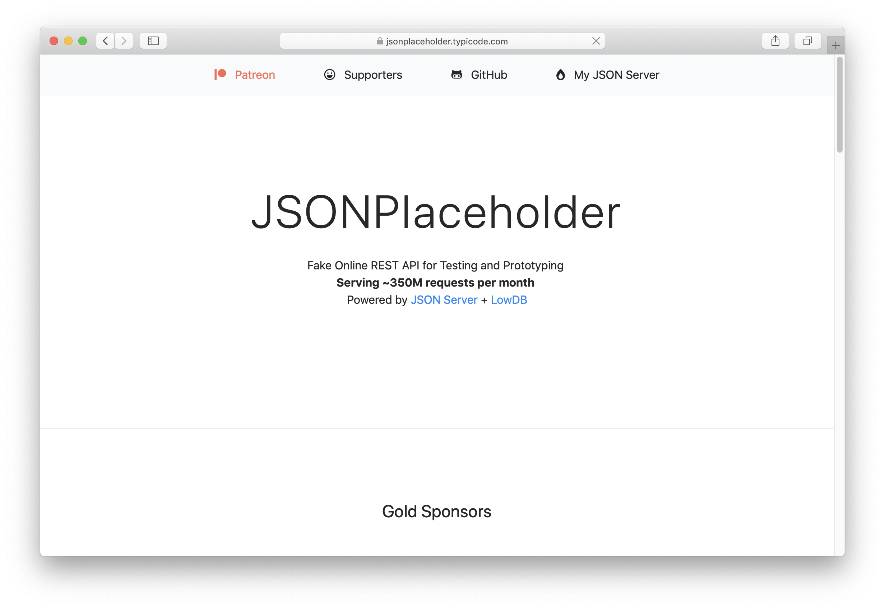
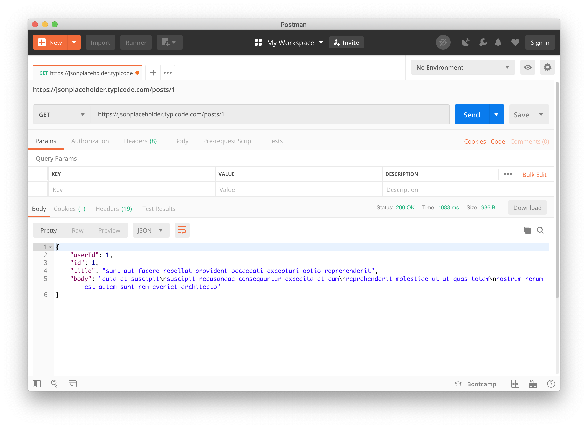
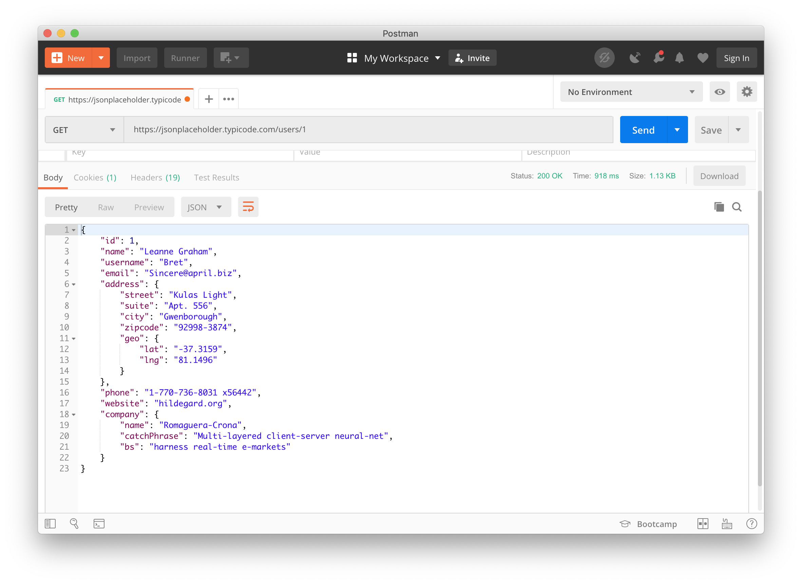
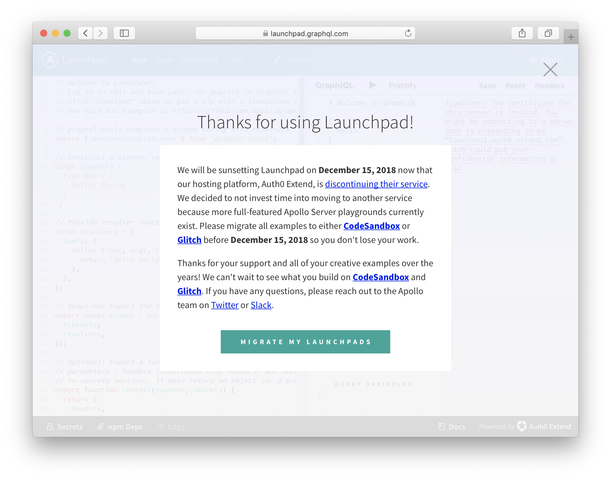
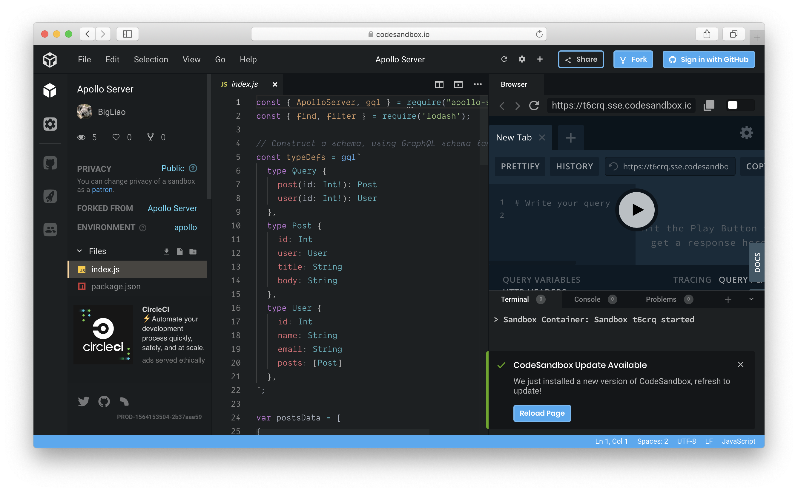
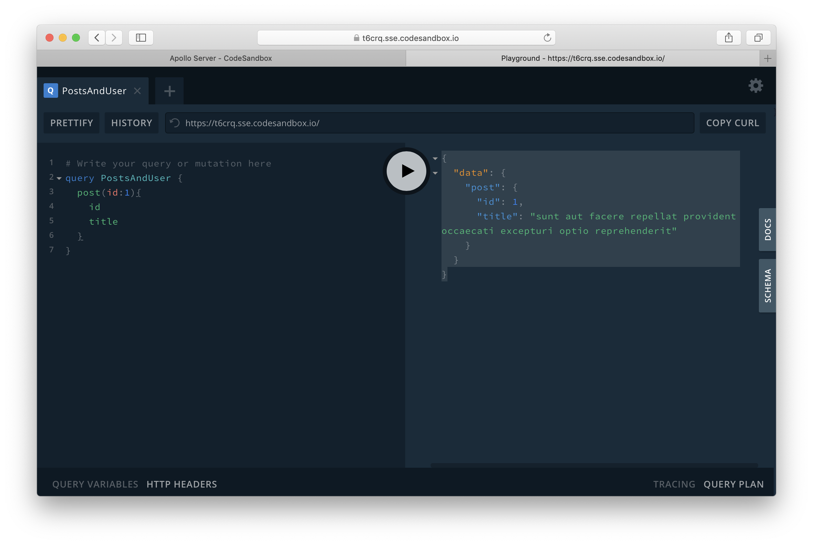

```yaml
---
Title: [翻译]REST vs. GraphQL
Author: Sebastian Eschweiler
Translator: BigLiao
OriginalURL: https://medium.com/codingthesmartway-com-blog/rest-vs-graphql-418eac2e3083
Date: 2019-07-29
---
```

# [翻译]REST vs. GraphQL

*This post has been published first on* [*CodingTheSmartWay.com*](http://codingthesmartway.com/?source=post_page---------------------------)

[**去 YouTube 上订阅作者**](https://www.youtube.com/channel/UCLXQoK41TOcIsWtY-BgB_kQ?sub_confirmation=1&source=post_page---------------------------)

REST 和 GraphQL 是 HTTP 请求数据的两种方式。基于 REST 的方式（REST-based）是传统的方式，最近几年采用这种方式的技术栈的比例比非常高。

GraphQL 的出现则是以一种革新的方式来对待 API 请求。事实上 GraphQL 能够克服 REST 的大部分缺点。在这个教程你能学到这两种技术之间的区别，并且通过许多实际例子，让你懂得为什么 GraphQL 能够帮你的应用建立高灵活性的 API 接口。让我们开始吧…...

## REST 介绍及其缺点

REST 全称是资源状态转移（Representational State Transfer），它是应用在 Web 服务中的一种 API 设计模式。符合 REST API 的 Web 服务，允许请求方使用统一的、预先设定的一系列无状态（stateless）操作，来获取和操作 Web 资源的文本表示（textual representations）。如果使用 HTTP 协议的话，最常用的操作就是 GET，POST，PUT 和 DELETE。

REST 的核心概念为一切都是资源。虽然 REST 在最初提出的时候是一种很好的解决方案，但是依然有许多重大问题，让这种设计模式至今诟病不已。现在我们就来看看 REST 的一些重大缺陷：

### 多次请求才能获得想要的资源

如今的很多网站和移动应用都是数据驱动的，需要大量的数据，这些数据来自不同的资源。通过 REST-based API 来获取这些数据往往需要我们经过多个来回的请求，才能获得我们想要的所有东西。举个例子，假设你获取一条信息流（post）的实体，同时又要获取这条信息流作者信息（假设这两个是分开的）。最典型的做法就是向 REST API 发送两条请求到（比如用 HTTP GET），第一个获取信息流内容，第二个获得作者信息，端点（endpoint）分别是：

`mydomain.com/posts/:id`

`mydomain.com/users/:id`

### 过度请求/不足请求

使用 RESTful 服务的另一个常见问题是关于*过度请求*和*不足请求*的问题。具体是什么意思呢？我们再回到之前的例子。我们通过 `mydomain.com/posts/:id` 获得某条信息流的内容，每条信息流由`id`、`title`、`user`和`body`这些属性组成，你每次都会返回这些数据的整个集合，没有办法限制说只返回数据的部分子集，比如只包含`title`和`user`。

### 举例

有一个叫 *JSONPlaceholder* 的网站可以测试 REST API 使用：

https://jsonplaceholder.typicode.com/ 



JSONPlaceholder 的 API 提供了许多端点（endpoint），或者称作资源（resource），例如：

- /posts
- /comments
- /users
- ...

想获取某条 post 的话，可通过这条 URL： `https://jsonplaceholder.typicode.com/posts/1` 来发送一个 HTTP GET 请求，这会请求 ID 为 1 的 post。你可以用 Postman 来发送这个请求：



返回的 JSON 对象包含了以下 post 数据：`id`，`title`，`user`，`body`。如上所述，请求某个具体 post 总是返回整个数据集合。

如果你现在想知道相应作者的信息，那么你就要再发送一条 GET 请求到服务器，请求 id 为 1 的 user 详情。所以你需要发送这个请求：`https://jsonplaceholder.typicode.com/users/1`：



使用 REST 的方式，需要通过两轮到服务器的请求才能获取信息流和相应的作者信息。

## GraphQL —— 一种不一样的方式

与 REST 类似，GraphQL 也是一种 API 设计模式，但是是一种不同的方式，它要灵活得多。**最主要和最重要的区别是，GraphQL 不是用来处理某个专用资源的，而是把所有东西作为相互连接的图来看待。**这意味着你可以裁剪请求来获得精确的需求。你可以使用 GraphQL 查询语句来描述你想要的答案。你可以组合不同的实体到一个请求中，并且能够指定每个层级需要包含的属性，例如：

```
{
     post(id: 1) {
        title
        user {
            name
            email
            courses {
                title
            }
        }
     }
}
```

### 举例

我们来看一些实际的案例。首先我们要设置一个能提供 post 和 user 数据的 GraphQL 服务（这样我们才能和之前的 REST 例子作对比）。

通过 [Apollo Launchpad](https://launchpad.graphql.com) 很容易创建一个简单的 GraphQL 服务。

> 译者注：Apollo Launchpad 已不再提供服务，推荐使用 CodeSandbox



下面使用 CodeSandbox 进行演示。通过这个链接可以打开案例：

 https://codesandbox.io/embed/apollo-server-t6crq



你可以直接上面的链接或者自己实现一个服务。下面是相应的 `JavaScript` 代码：

```javascript
const { ApolloServer, gql } = require("apollo-server");
const { find, filter } = require('lodash');

// Construct a schema, using GraphQL schema language
const typeDefs = gql`
  type Query {
    post(id: Int!): Post
    user(id: Int!): User
  },
  type Post {
    id: Int
    user: User
    title: String
    body: String
  },
  type User {
    id: Int
    name: String
    email: String
    posts: [Post]
  },
`;

var postsData = [
{
  id: 1,
  userId: 1,
  title: 'sunt aut facere repellat provident occaecati excepturi optio reprehenderit',
  body: 'quia et suscipitsuscipit recusandae consequuntur expedita et cumreprehenderit molestiae ut ut quas totamnostrum rerum est autem sunt rem eveniet architecto'
},
{
  userId: 2,
  id: 2,
  title: 'qui est esse',
  body: 'est rerum tempore vitae\nsequi sint nihil reprehenderit dolor beatae ea dolores neque\nfugiat blanditiis voluptate porro vel nihil molestiae ut reiciendis\nqui aperiam non debitis possimus qui neque nisi nulla'
},
{
  userId: 1,
  id: 3,
  title: 'ea molestias quasi exercitationem repellat qui ipsa sit aut',
  body: 'et iusto sed quo iure\nvoluptatem occaecati omnis eligendi aut ad\nvoluptatem doloribus vel accusantium quis pariatur\nmolestiae porro eius odio et labore et velit aut'
},
{
  userId: 2,
  id: 4,
  title: 'eum et est occaecati',
  body: 'ullam et saepe reiciendis voluptatem adipisci\nsit amet autem assumenda provident rerum culpa\nquis hic commodi nesciunt rem tenetur doloremque ipsam iure\nquis sunt voluptatem rerum illo velit'
}
];
var usersData = [
{
  id: 1,
  name: 'Leanne Graham',
  email: 'Sincere@april.biz'
},
{
  id: 2,
  name: 'Ervin Howell',
  email: 'Shanna@melissa.tv'
}
];
var getPost = function(root, {id}) { 
  return postsData.filter(post => {
    return post.id === id;
  })[0];
};
var getUser = function(root, {id}) {
  return usersData.filter(user => {
    return user.id === id;
  })[0];
};

// Provide resolver functions for your schema fields
const resolvers = {
  Query: {
    post: getPost,
    user: getUser,
  },
  User: {
    posts: (user) => filter(postsData, { userId: user.id }),
  },
  Post: {
    user: (post) => find(usersData, { id: post.userId }),
  },
};

const server = new ApolloServer({
  typeDefs,
  resolvers
});

server.listen().then(({ url }) => {
  console.log(`🚀 Server ready at ${url}`);
});

```

现在我们已经准备好可以执行一些查询来从这个 GraphQL 服务获取数据了。直接在右侧的浏览器输入框中输入查询代码：

```javascript
# Write your query or mutation here
query PostsAndUser {
  post(id:1){
    id
    title
  }
}
```

执行这个查询预计可以获得数据如下：

```json
{
  "data": {
    "post": {
      "id": 1,
      "title": "sunt aut facere repellat provident occaecati excepturi optio reprehenderit"
    }
  }
}
```



